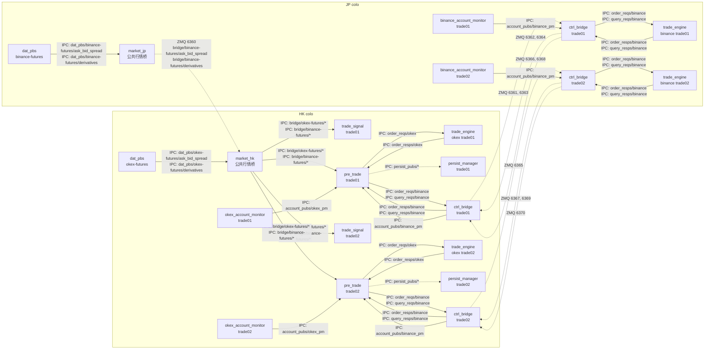

# XARB OKEX-Binance (OKEX 开, Binance 平) Colo 部署说明

目标: 部署 `xarb-okex-binance` 跨所套利, OKEX 负责开仓, Binance 负责对冲/平仓. 进程分布在 HK/JP 两地机房, 临时通过 `ipc_bridge + ZMQ` 连接跨机 IPC, 后续有专线后替换传输链路.

本文以 **同时部署两套实例** 为例:

- `okex-binance-xarb-trade01`
- `okex-binance-xarb-trade02`

本文约定:

- **HK**: `trade_signal + pre_trade + persist_manager + trade_engine(okex) + okex_account_monitor` 主控侧, 同时运行 OKEX 行情
- **JP**: Binance 行情 + Binance `trade_engine` + `binance_account_monitor`
- **公共行情 bridge**: 只负责市场数据, 是公共基础设施, 多套实例共享
- **实例业务 bridge**: 只负责某一套实例的 `order/query req/rsp/account_pubs`, 必须按实例隔离
- 当前首套落地实例: `IPC_NAMESPACE=okex_binance_xarb_trade01`
- HK IP: `47.238.128.48`
- JP IP: `54.64.147.69`

---

## 架构图 (以 `okex-futures` + `binance-futures`, 且 `trade01 + trade02` 并存为例)



说明:

- 本文只讨论 `okex-futures` 开仓, `binance-futures` 对冲/平仓.
- 公共行情桥只做一次:
  - HK 负责把本地 `okex-futures` 行情转成 `bridge/okex-futures/*`
  - JP 负责把本地 `binance-futures` 行情转成 `bridge/binance-futures/*`
  - JP 再把 Binance 行情跨机送到 HK
- `trade_signal` 与 `pre_trade` 始终一起部署在 HK, 统一消费本地 `bridge/*` 行情.
- `okex_account_monitor` 跟随 HK 本地实例部署; `binance_account_monitor` 跟随 JP 本地实例部署.
- 对 `trade01` / `trade02` 来说, 行情层是共享输入; 它们不需要知道 Binance 行情来自 JP.
- `order_reqs/*` / `order_resps/*` / `query_reqs/*` / `query_resps/*` / `account_pubs/*` 是实例私有控制面:
  - `trade01` 一套端口
  - `trade02` 一套端口
  - 不能复用
- `account_pubs/binance_pm` 必须按原 IPC 名称桥回 HK, 供对应实例的 `pre_trade` 直接订阅.
- `account_pubs/binance_pm` 是实例业务 IPC, 不是市场桥的一部分, 不能落到 `bridge/*`.
- 命名规则要保持和现有代码一致:
  - bridge 配置里仍写 `account_pubs/binance_pm`
  - `trade01` 实际落地 service 是 `<IPC_NAMESPACE_trade01>/account_pubs/binance_pm`
  - `trade02` 实际落地 service 是 `<IPC_NAMESPACE_trade02>/account_pubs/binance_pm`
  - 不要自定义成 `account_pubs/binance_pm_trade01` 这类新名字
- `persist_manager` 是旁路: 即便落盘异常, 也不应阻塞交易关键路径.

---

## 进程部署位置 (你给出的硬约束)

- HK:
  - `pre_trade` (xarb, 每套实例各一份)
  - `trade_signal` (xarb, 每套实例各一份)
  - `persist_manager` (xarb, 每套实例各一份)
  - `trade_engine --exchange okex` (每套实例各一份)
  - `okex_account_monitor` (每套实例各一份)
  - OKEX 行情 `dat_pbs/okex-futures` (以及按需的 `okex-margin`)
  - `ipc_bridge market_hk` (公共行情桥, 只一份)
  - `ipc_bridge ctrl_<instance>` (实例业务桥, 每套实例各一份)
- JP:
  - Binance 行情 `dat_pbs/binance-futures` (以及按需的 `binance-margin`)
  - `trade_engine --exchange binance` (每套实例各一份)
  - `binance_account_monitor` (每套实例各一份)
  - `ipc_bridge market_jp` (公共行情桥, 只一份)
  - `ipc_bridge ctrl_<instance>` (实例业务桥, 每套实例各一份)

部署建议:

- `okex_account_monitor` 放 HK, `binance_account_monitor` 放 JP (离交易所更近, 也减少跨站点依赖)
- Redis 推荐放 HK (与 `pre_trade`/`trade_signal` 同机房), JP 侧尽量减少对 Redis 的硬依赖

---

## 前置准备

### 1) 两端 `mkt_cfg.yaml` 必须就位

注意: 多个二进制 (包含 `dat_pbs` / `trade_engine` / account monitors) **不是**读仓库 `config/mkt_cfg.yaml`, 而是读:

`$HOME/dat_pbs/config/mkt_cfg.yaml`

因此:

- HK 机器上确保 `~/dat_pbs/config/mkt_cfg.yaml` 包含 OKEX 相关 venue 的配置
- JP 机器上确保 `~/dat_pbs/config/mkt_cfg.yaml` 包含 Binance 相关 venue 的配置

### 2) 为每套实例准备各自环境目录与 `IPC_NAMESPACE`

两台机器都要为每套实例准备同名目录, 例如:

- `~/okex-binance-xarb-trade01/`
- `~/okex-binance-xarb-trade02/`

在 HK 为 `trade01` 生成 env:

```bash
scripts/deploy_setup_env_xarb.sh \
  --env-name okex-binance-xarb-trade01 \
  --open-venue okex-futures \
  --hedge-venue binance-futures
```

在 HK 为 `trade02` 生成 env:

```bash
scripts/deploy_setup_env_xarb.sh \
  --env-name okex-binance-xarb-trade02 \
  --open-venue okex-futures \
  --hedge-venue binance-futures
```

然后分别把两套 env **原样复制**到 JP 同路径, 以确保各实例自己的 `IPC_NAMESPACE` 一致.

要点:

- 公共行情桥不依赖实例级 `IPC_NAMESPACE`.
- 但实例业务桥与 `trade_engine` / `pre_trade` 相关的 `order/query req/rsp` 仍依赖各自实例的 `IPC_NAMESPACE`.
- `trade01` 的业务桥只能服务 `trade01`; `trade02` 的业务桥只能服务 `trade02`.

### 3) ZMQ 端口与防火墙

当前首套 `trade01` 按你给定的 `6360-6370` 端口段, 固定使用:

- 公共行情桥:
  - `6360/tcp`: JP -> HK Binance 行情 (`ask_bid_spread + derivatives`, 公共共享)
- `okex_binance_xarb_trade01` 业务桥:
  - `6361/tcp`: HK -> JP `order_reqs/binance`
  - `6362/tcp`: JP -> HK `order_resps/binance`
  - `6363/tcp`: HK -> JP `query_reqs/binance`
  - `6364/tcp`: JP -> HK `query_resps/binance`
  - `6365/tcp`: JP -> HK `account_pubs/binance_pm`

如果后续再增加 `trade02`, 继续从 `6366` 往后分配一组新的业务端口即可, 但:

- `6360/tcp` 的公共行情桥仍然只部署一套, 不重复部署
- `trade02` 不能复用 `trade01` 的 `6361-6365`

因此需要:

- HK 放行入站: `6360`, `6362`, `6364`, `6365`
- JP 放行入站: `6361`, `6363`

---

## 为什么需要部署这些 bridge (以 `okex_binance_xarb_trade01` 为例)

- `trade_signal + pre_trade` 固定在 HK, 但 Binance 行情、Binance `trade_engine`、`binance_account_monitor` 在 JP, 所以必须有跨机 bridge.
- 行情桥和业务桥必须分开:
  - 行情桥是公共基础设施, 负责把 JP 的 Binance 行情一次性送到 HK 本地 `bridge/binance-futures/*`
  - 业务桥是实例私有控制面, 负责 `order/query/account_pubs`
- `pre_trade` 不只是发单, 还会走 Binance `query_reqs/query_resps`, 所以 query 桥必须部署, 不能只桥 `order_reqs/order_resps`.
- `binance_account_monitor` 在 JP 就近部署更合理, 但 `pre_trade` 在 HK 需要直接消费 `account_pubs/binance_pm`, 所以这个 account stream 也必须从 JP 桥回 HK.
- bridge 配置里不要手工拼 namespace:
  - 配置仍写 `order_reqs/binance`
  - 配置仍写 `query_resps/binance`
  - 配置仍写 `account_pubs/binance_pm`
  - 实际隔离由 `IPC_NAMESPACE=okex_binance_xarb_trade01` 完成
- 对其他业务进程来说, 因为本地消费的都是 IPC:
  - 行情统一读 HK 本地 `bridge/*`
  - Binance 业务统一读/写本地 `order_*` / `query_*` / `account_pubs/*`
  - 所以跨机器部署应当是“无感”的

```text
HK 47.238.128.48                                  JP 54.64.147.69
----------------                                  ----------------
dat_pbs/okex-futures                              dat_pbs/binance-futures
        |                                                  |
        v                                                  v
  market_hk bridge <========== 6360 ==========>      market_jp bridge
        |                                                  |
        | 本地提供 bridge/okex-futures/*                  | 本地提供 bridge/binance-futures/*
        | 本地提供 bridge/binance-futures/*               |
        v                                                  v
 trade_signal + pre_trade                         trade_engine --exchange binance
        |                                                  ^
        | 6361 order_reqs/binance                          |
        | 6363 query_reqs/binance                          |
        v                                                  |
   ctrl_bridge_hk  <===== 实例业务桥 =====>          ctrl_bridge_jp
        ^                                                  |
        | 6362 order_resps/binance                         |
        | 6364 query_resps/binance                         |
        | 6365 account_pubs/binance_pm                     |
        |                                                  v
 trade_engine --exchange okex                     binance_account_monitor
 okex_account_monitor
 persist_manager
```

---

## bridge 配置 (核心)

仓库当前这两份配置已经直接写成**首套 `trade01` 实配**:

- [config/ipc_bridge_xarb_okex_binance_hk.yaml](/home/ubuntu/crypto_mkt/mkt_signal/config/ipc_bridge_xarb_okex_binance_hk.yaml)
- [config/ipc_bridge_xarb_okex_binance_jp.yaml](/home/ubuntu/crypto_mkt/mkt_signal/config/ipc_bridge_xarb_okex_binance_jp.yaml)

它们对应的是:

- HK: `47.238.128.48`
- JP: `54.64.147.69`
- `IPC_NAMESPACE=okex_binance_xarb_trade01`
- 端口: `6360-6365`

如果后续要扩到 `trade01 + trade02` 并存, 这两份配置可以直接作为 `trade01` 模板, 然后复制出 `trade02` 版本并分配新的业务端口. 生产部署建议拆成两类配置:

- 公共行情桥:
  - HK:
    - 本地 OKEX: `dat_pbs/okex-*/... -> bridge/okex-*/...` (ipc->ipc)
    - 远端 Binance 行情接入: `zmq(bind) -> bridge/binance-futures/...` (zmq->ipc)
  - JP:
    - 本地 Binance: `dat_pbs/binance-*/... -> bridge/binance-*/...` (ipc->ipc)
    - Binance 行情跨机发送: `bridge/binance-futures/... -> zmq(connect HK)` (ipc->zmq)
- 实例业务桥:
  - 每套实例各自维护一组 Binance `order/query req/rsp/account_pubs`:
    - `order_reqs/binance`
    - `order_resps/binance`
    - `query_reqs/binance`
    - `query_resps/binance`
    - `account_pubs/binance_pm`
  - 这组 IPC 名称保持原样, 不改成 `bridge/*`, 只是在 HK/JP 间做实例级转发.
  - `trade01` 与 `trade02` 使用不同端口, 不能复用同一组 ZMQ 端口.

---

## 部署与启动顺序 (建议)

### HK 侧

1) 启动 OKEX 行情:

```bash
cd ~/dat_pbs/okex-futures && ./scripts/start_dat_pbs.sh
# 如需 okex-margin:
cd ~/dat_pbs/okex-margin && ./scripts/start_dat_pbs.sh
```

2) 部署并启动公共行情桥 `market_hk`:

```bash
cd ~/bridge_hk_market
# 使用单独的公共行情 bridge 配置:
# - dat_pbs/okex-*/... -> bridge/okex-*/...
# - zmq(HK:6360) -> bridge/binance-futures/{ask_bid_spread,derivatives}
./scripts/start_ipc_bridge.sh
```

3) 为每套实例部署并启动实例业务桥:

```bash
# trade01
cd ~/bridge_hk_trade01
# 该 bridge 只负责 trade01 的:
# - order_reqs/order_resps
# - query_reqs/query_resps
# - account_pubs/binance_pm (JP -> HK)
# 并加载 ~/okex-binance-xarb-trade01/env.sh
./scripts/start_ipc_bridge.sh

# trade02
cd ~/bridge_hk_trade02
# 同理, 但端口使用 6366-6370 中属于 trade02 的分配
./scripts/start_ipc_bridge.sh
```

4) 启动 OKEX `trade_engine` 与 `okex_account_monitor` (每套实例各一份):

```bash
cd ~/okex-binance-xarb-trade01
source ./env.sh

# trade01: ./trade_engine --exchange okex
# trade01: ./okex_account_monitor
# trade02: 在 ~/okex-binance-xarb-trade02 下同样启动一份
```

5) 启动 `persist_manager` (每套实例各一份):

```bash
cd ~/okex-binance-xarb-trade01
./xarb_scripts/start_xarb_persist_manager.sh
# trade02 在 ~/okex-binance-xarb-trade02 下同样启动
```

6) 启动 `pre_trade` 与 `trade_signal` (每套实例各一份):

```bash
cd ~/okex-binance-xarb-trade01
./xarb_scripts/start_xarb_pre_trade.sh
./xarb_scripts/start_xarb_trade_signal.sh
# trade02 在 ~/okex-binance-xarb-trade02 下同样启动
```

### JP 侧

1) 启动 Binance 行情:

```bash
cd ~/dat_pbs/binance-futures && ./scripts/start_dat_pbs.sh
# 可选:
cd ~/dat_pbs/binance-margin && ./scripts/start_dat_pbs.sh
```

2) 部署并启动公共行情桥 `market_jp`:

```bash
cd ~/bridge_jp_market
# 使用单独的公共行情 bridge 配置:
# - dat_pbs/binance-*/... -> bridge/binance-*/...
# - bridge/binance-futures/{ask_bid_spread,derivatives} -> zmq(HK:6360)
./scripts/start_ipc_bridge.sh
```

3) 为每套实例部署并启动实例业务桥:

```bash
cd ~/bridge_jp_trade01
# 加载 ~/okex-binance-xarb-trade01/env.sh
# 负责 trade01 的 Binance order/query req/rsp + account_pubs/binance_pm
./scripts/start_ipc_bridge.sh

cd ~/bridge_jp_trade02
# 加载 ~/okex-binance-xarb-trade02/env.sh
# 负责 trade02 的 Binance order/query req/rsp + account_pubs/binance_pm
./scripts/start_ipc_bridge.sh
```

4) 启动 Binance `trade_engine` 与 `binance_account_monitor` (每套实例各一份):

```bash
cd ~/okex-binance-xarb-trade01
source ./env.sh
# trade01: ./trade_engine --exchange binance
# trade01: ./binance_account_monitor
# trade02: 在 ~/okex-binance-xarb-trade02 下同样启动一份
```

---

## 已确认的首套部署输入

1) 机器与网络
   - HK: `47.238.128.48`
   - JP: `54.64.147.69`
   - 当前先按两台机器公网直连的 `tcp://<ip>:<port>` 方式配置 ZMQ
2) 当前实例
   - `IPC_NAMESPACE=okex_binance_xarb_trade01`
   - `trade_signal` 与 `pre_trade` 始终一起部署在 HK
3) bridge 范围
   - 公共行情桥只做一次
   - `order/query/account_pubs` 都走实例业务桥
4) account monitor
   - `okex_account_monitor` 在 HK
   - `binance_account_monitor` 在 JP
